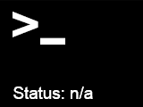

# Anbernic StockOS Apps

The purpose of this repository is to share simple applications that can be run in the StockOS and enhance the experience with the device.  
The applications have been tested with the `RG35XXH-V1.1.0-EN16GB-240428` firmware on an `ANBERNIC RG35XX H`.

## Usage

The repository contains 
- [SSH](#ssh)
- [SetLocale](#set-locale)

In order to use the applications correctly, the following steps should be followed:

- insert the Anbernic destination SD card into your computer reader (the card should already have the default Anbernic folder structure in it)
- copy the content of each application folder from the repository in the Anbernic SD card into the `Roms/APPS` folder
- create a new `Imgs` folder in `Roms/APPS`
- move each bash scripts (.sh files) from inside each application folders into the parent (`Roms/APPS`)
- copy the image with suffix `_black.png` from each `Imgs` folder of each application folder into `Roms/APPS/Imgs` 
- rename each image with the `_black.png` suffix in the `Roms/APPS/Imgs` folder to the name of the related bash script (name is case sensitive)
- the SD card can be ejected now

If both the applications are copied the result should be like the following:

```bash
.
├── Imgs
│   ├── SSH.png
│   └── SetLocale.png
├── SSH
│   └── Imgs
│       ├── ssh_black.png
│       ├── ssh_green.png
│       └── ssh_red.png
├── SSH.sh
├── SetLocale
│   └── Imgs
│       ├── setlocale_black.png
│       ├── setlocale_green.png
│       └── setlocale_red.png
└── SetLocale.sh
```

In order to execute the scripts on the Anbernic device:

- the SD card must be correctly inserted
- select the `App Center` icon from the main menu
- select the `APPS` icon from inside the `App Center` screen
- select from the menu the card slot with the SD that contains the applications (01 or 02)
- a list with all the applications installed into the SD should now be visible, and the applications just installed should be listed
- select the application you want to run and then press `B`

## Applications

### SSH



This application installs all the necessary packages to enable SSH server in StockOS. In order for the script to be executed correctly the `device must be connected to the Wi-Fi` and the connection should be stable.

In case of successful execution the icon should become green. The device IP can be found in the `Settings/Network Settings/WIFI Settings` menu, the default username is **game** and the password is also **game**.

Once logged in, it is possible to become **root** executing the `sudo -i` command.

The re-execution of the script will stop the SSH service and the icon displayed should become red.

**Hint:** before running the SSH script it is recommended to execute the SetLocale script.

#### Gotchas

Sometimes, after the console is coming back from standby or after restarting the device, if the network is slow to come back up and assign the network IP, the SSH server starts correctly but it doesn't listen to the new associated network address (in this case the icon will still be green even if it is not possible to login to the device). To solve the issue re-run the SSH script to restart the SSH server.

### Set locale


This script changes the locale from the default one (Chinese) to **en_GB.UTF-8**.
